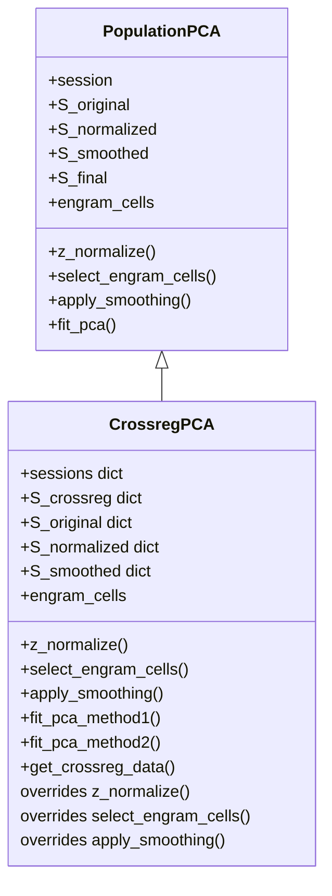

# CrossregPCA z_normalize() Fix Plan

## Bug Description

In [`SSTCa2_population.py`](SSTCa2_population.py:1688), line 1688 calls `crossreg_pca.z_normalize()` which fails because:

1. [`CrossregPCA.__init__()`](SSTCa2_population.py:543-546) calls parent `PopulationPCA.__init__()` with `session=None`:
   ```python
   def __init__(self, sessions, mouse, mouse_group, mappings=None, config=None):
       super().__init__(None, mouse, mouse_group, config)  # session=None
   ```

2. [`PopulationPCA.z_normalize()`](SSTCa2_population.py:127-158) accesses `self.session.S` on line 138:
   ```python
   S = self.session.S  # Fails when self.session is None
   ```

3. When [`run_population_pca_pipeline()`](SSTCa2_population.py:1688) calls `crossreg_pca.z_normalize()`, it raises `AttributeError: 'NoneType' object has no attribute 'S'`

## Root Cause

`CrossregPCA` stores sessions in `self.sessions` dict (not `self.session`), but inherits `z_normalize()` from `PopulationPCA` which expects `self.session`.

## Solution

Implement a new `z_normalize()` method in `CrossregPCA` that:
- Normalizes each session independently using per-session statistics (Option B)
- Stores normalized data in a dict structure matching `self.S_crossreg` keys
- Updates `select_engram_cells()` and `apply_smoothing()` to work with the new structure

## Implementation Plan

### 1. Add `z_normalize()` method to `CrossregPCA`

Location: After `get_crossreg_data()` method (after line 580)

```python
def z_normalize(self):
    """Z-score normalize neural activity per neuron, per session.
    
    For each session in self.S_crossreg, normalizes each cell's activity
    independently using that session's mean and std across time.
    
    Returns
    -------
    S_normalized : dict
        Dictionary mapping session names to normalized neural activity
    """
    if self.S_crossreg is None or not self.crossreg_session_names:
        self.get_crossreg_data()
    
    self.S_normalized = {}
    self.S_original = {}
    
    for name, S in self.S_crossreg.items():
        self.S_original[name] = S.copy()
        
        # Z-score normalize per cell (row-wise) within this session
        S_normalized = np.zeros_like(S)
        for cell in range(S.shape[0]):
            cell_data = S[cell, :]
            mean_val = np.nanmean(cell_data)
            std_val = np.nanstd(cell_data)
            if std_val > 0:
                S_normalized[cell, :] = (cell_data - mean_val) / std_val
            else:
                S_normalized[cell, :] = 0.0
        
        # Replace NaN with 0
        S_normalized = np.nan_to_num(S_normalized, nan=0.0)
        self.S_normalized[name] = S_normalized
    
    return self.S_normalized
```

### 2. Update `select_engram_cells()` for CrossregPCA

The current inherited method uses `self.S_normalized.sum(axis=1)` which won't work with a dict. Need to:
- Compute total activity across all sessions for each cell
- Store engram cell mask that applies to the common cell dimension

```python
def select_engram_cells(self, threshold=None):
    """Select engram cells based on z-scored total activity across sessions.
    
    Parameters
    ----------
    threshold : float, optional
        Z-score threshold for engram cell selection.
    
    Returns
    -------
    engram_cells : ndarray
        Boolean array of engram cell indices
    """
    if threshold is None:
        threshold = self.engram_threshold
    
    if self.S_normalized is None or not isinstance(self.S_normalized, dict):
        raise ValueError("Call z_normalize() first before selecting engram cells")
    
    # Sum normalized activity across all sessions for each cell
    total_activity = np.zeros(self.S_original['TFC_cond'].shape[0])
    for name, S_norm in self.S_normalized.items():
        total_activity += S_norm.sum(axis=1)
    
    # Z-score the total activity
    activity_z = zscore(total_activity)
    
    # Select cells above threshold
    self.engram_cells = activity_z > threshold
    
    return self.engram_cells
```

### 3. Update `apply_smoothing()` for CrossregPCA

```python
def apply_smoothing(self, sigma=None):
    """Apply Gaussian smoothing along the time axis for each session.
    
    Parameters
    ----------
    sigma : float, optional
        Standard deviation for Gaussian kernel.
    
    Returns
    -------
    S_smoothed : dict
        Dictionary mapping session names to smoothed neural activity
    """
    if sigma is None:
        sigma = self.smoothing_sigma
    
    if self.S_normalized is None or not isinstance(self.S_normalized, dict):
        raise ValueError("Call z_normalize() first before applying smoothing")
    
    self.S_smoothed = {}
    for name, S_norm in self.S_normalized.items():
        self.S_smoothed[name] = gaussian_filter1d(S_norm, sigma=sigma, axis=1)
    
    return self.S_smoothed
```

### 4. Modify `fit_pca_method1()` and `fit_pca_method2()` to avoid double-normalization

Both methods already compute their own normalization internally (lines 604-608, 621-624, 653-657, 672-675). They should be modified to:
- Check if `self.S_normalized` dict is available (from prior `z_normalize()` call)
- If available, use the pre-normalized data directly
- If not available, fall back to internal normalization (for backward compatibility)

This avoids double-normalization when `z_normalize()` is called before `fit_pca_method1/2()`.

### 5. Update `run_population_pca_pipeline()` calls

Lines 1688 and 1735 call `z_normalize()` followed by `select_engram_cells()` and `apply_smoothing()`. These should work with the new dict-based structure.

## Changes Summary

| File | Line(s) | Change |
|------|---------|--------|
| [`SSTCa2_population.py`](SSTCa2_population.py:580) | After line 580 | Add `z_normalize()` method to `CrossregPCA` |
| [`SSTCa2_population.py`](SSTCa2_population.py:580) | After line 580 | Add `select_engram_cells()` override for `CrossregPCA` |
| [`SSTCa2_population.py`](SSTCa2_population.py:580) | After line 580 | Add `apply_smoothing()` override for `CrossregPCA` |
| [`SSTCa2_population.py`](SSTCa2_population.py:580) | After line 580 | Update `__init__` to initialize new instance variables |

## Testing

1. Verify `crossreg_pca.z_normalize()` returns a dict with keys matching session names
2. Verify `crossreg_pca.select_engram_cells()` returns a boolean array of cell indices
3. Verify `crossreg_pca.apply_smoothing()` returns a dict with smoothed data
4. Verify `fit_pca_method1()` and `fit_pca_method2()` still produce correct results
5. Run `run_population_pca_pipeline()` and verify no errors

## Diagram


